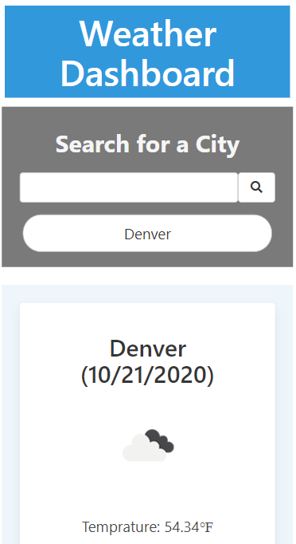

# 06_Weather_Dashboard

This weather dashboard gives you the current and 5-day forecast for a city.  It also saves your recent weather searches.

 
 

## Internet Address

https://benjdg.github.io/06_Weather_Dashboard/

 
 

## Screenshot Desktop

 
 

## Screenshot Mobile

 
 

## Usage

Type the name of a city into the search box and click the search button.

 
 

## Contributing

Pull requests are welcome. For major changes, please open an issue first to discuss what you would like to change.

 
 

## License
[GNU GPLv3](https://choosealicense.com/licenses/gpl-3.0/)